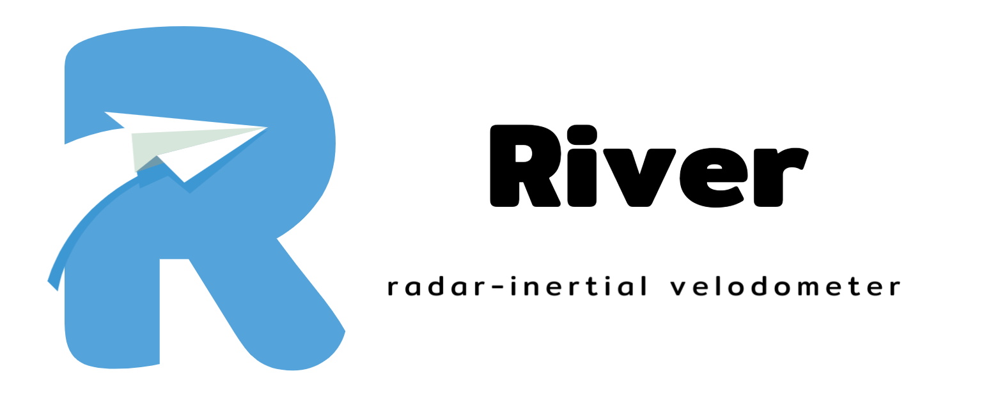
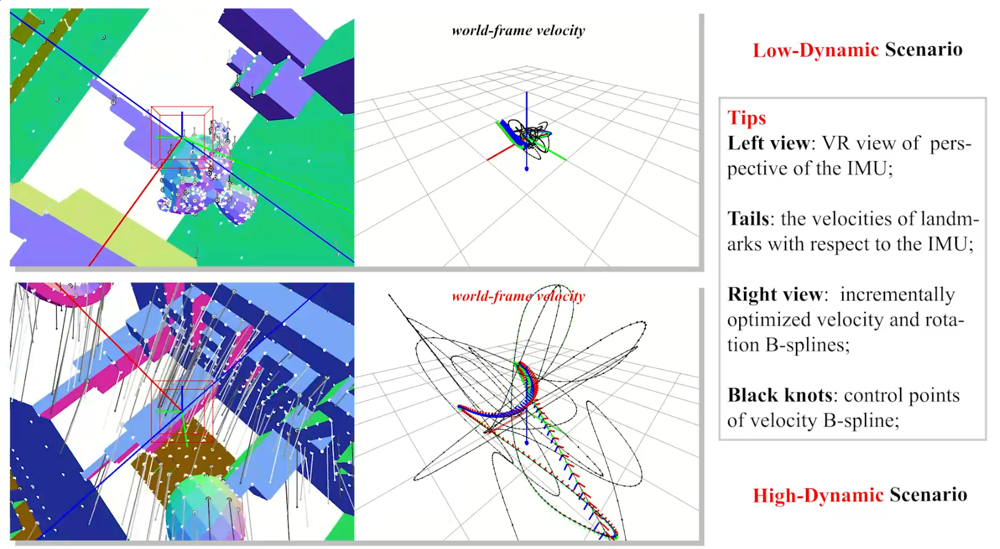
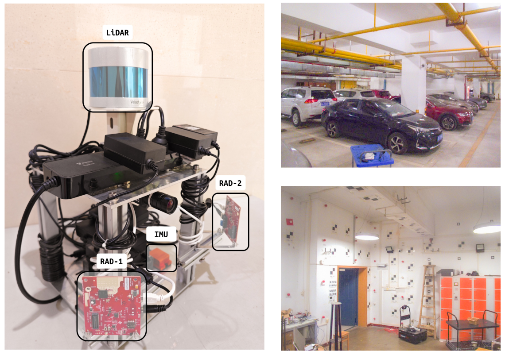

# River: A Tightly-coupled Radar-inertial Velocity Estimator

           

<div align=center></div>

## 0. Preliminaries

If you use `River` in a scientific publication, please cite the following paper 👇:
- **S. Chen**, X. Li*, S. Li, Y. Zhou and S. Wang, "River: A Tightly-Coupled Radar-Inertial Velocity Estimator Based on Continuous-Time Optimization," in IEEE Robotics and Automation Letters (RA-L), 2024. [[paper](https://ieeexplore.ieee.org/document/10529532)] [[code](https://github.com/Unsigned-Long/River)] [[video](https://www.bilibili.com/video/BV15D421W7NX/)]

<p align="left">
    :tada: <a href="https://github.com/Unsigned-Long/iKalibr.git"><strong>News: Using iKalibr To Calibrate Your Radar-Inertial Sensor Suite »</strong></a>
</p> 

+ supports one-shot multi-radar multi-IMU spatial and temporal determination;
+ not require any additional artificial infrastructure or prior knowledge;
+ capable of accurate and consistent calibration, you can find `iKalibr` [here](https://github.com/Unsigned-Long/iKalibr.git);

<p align="left">
    <a><strong>Todo List »</strong></a>
</p> 

- [x] [double free or corruption (out) Issue #3](https://github.com/Unsigned-Long/River/issues/3) 
- [ ] handle standstill motion (stationary) case (directly quit estimator, currently).
- [ ] support multi-radar multi-inertial velocity estimation.
- [ ] support online radar-inertial calibration.

## 1. Overview

Continuous and reliable ego-velocity information is significant for high-performance motion control and planning in a variety of robotic tasks. While linear velocities as first-order kinematics can be simultaneously estimated with other states or explicitly obtained by differentiation from positions in ego-motion estimators such as odometers, the high coupling leads to instability and even failures when estimators degenerate. To this end, we present `River`: an accurate and continuous linear velocity estimator that efficiently fuses high-frequency inertial and radar target measurements based on continuous-time optimization.


Our accompanying videos are now available on [YouTube](https://youtu.be/bkavz2SuZ_s) (click below images to open) and [Bilibili](https://www.bilibili.com/video/BV15D421W7NX/).

<hr style=" height:4px;border:none;border-top:4px solid #8a589f;border-bottom:4px solid #f34b7d;" />
<div align=center>
<a href="https://youtu.be/bkavz2SuZ_s">
    
</a>
    <a href="https://youtu.be/bkavz2SuZ_s">
    
</a>
</div>

<hr style=" height:4px;border:none;border-top:4px solid #8a589f;border-bottom:4px solid #f34b7d;" />

## 2. Build River

### 2.1 Preparation

+ install `ROS1` (Ubuntu **20.04** is suggested, Ubuntu **18.04** (ros melodic) is also available):

  ```bash
  sudo apt install ros-noetic-desktop-full
  echo "source /opt/ros/noetic/setup.bash" >> ~/.bashrc
  source ~/.bashrc
  ```

  **Requirements: ROS1 & C++17 Support**

+ install `Ceres`:

  see the `GitHub` Profile of **[Ceres](https://github.com/ceres-solver/ceres-solver.git)** library, clone it, compile it, and install it. **Make sure that the version of `Ceres` contains the `Manifold` module. (`Ceres` version equal to 2.2.0 or higher than that)**

+ install `Sophus`:

  see the `GitHub` Profile of **[Sophus](https://github.com/strasdat/Sophus.git)** library, clone it, compile it, and install it. **Set option`SOPHUS_USE_BASIC_LOGGING` `ON` when compile (`cmake`) the Sophus library, this would avoid to involve `fmt` logger dependency (as the following `spdlog` would use internal `fmt` too, which may lead to conflict).**

+ install `magic-enum`:

  see the `GitHub` Profile of **[magic-enum](https://github.com/Neargye/magic_enum.git)** library, clone it, compile it, and install it.

+ install `Pangolin`:

  see the `GitHub` Profile of **[Pangolin](https://github.com/stevenlovegrove/Pangolin.git)** library, clone it, compile it, and install it.

+ install `spdlog`:

  see the `GitHub` Profile of **[spdlog](https://github.com/gabime/spdlog.git)** library, clone it, compile it, and install it. **Though this library can be installed by `sudo apt-get install libspdlog-dev`, the version is too old to support `river`, thus installing from the source is recommended.**

+ install `cereal`, `yaml-cpp`:

  ```bash
  sudo apt-get install libcereal-dev
  sudo apt-get install libyaml-cpp-dev
  ```

### 2.2 Clone and Compile River

+ create a ros workspace if needed and clone `River` to `src` directory as `river`:

  ```bash
  mkdir -p ~/River/src
  cd ~/River/src
  
  git clone --recursive https://github.com/Unsigned-Long/River.git river
  ```

  change directory to '`river`', and run '`build_thirdparty.sh`'.

  ```bash
  cd river
  chmod +x build_thirdparty.sh
  ./build_thirdparty.sh
  ```

  this would build '`tiny-viewer`' and '`ctraj`' libraries.

+ Prepare for thirdparty ros packages:

  clone ros packages '`ainstein_radar`', '`ti_mmwave_rospkg`', '`serial`', '`sbg_ros_driver`' to '`river/..`' (directory at the same level as `river`):

  ```sh
  cd ..
  git clone https://github.com/AinsteinAI/ainstein_radar.git
  git clone https://github.com/Unsigned-Long/ti_mmwave_rospkg.git
  git clone https://github.com/wjwwood/serial.git
  git clone https://github.com/SBG-Systems/sbg_ros_driver.git
  ```

  then change directory to the ros workspace to build these packages:

  ```sh
  cd ..
  catkin_make -DCATKIN_WHITELIST_PACKAGES="ainstein_radar;ti_mmwave_rospkg;serial;sbg_driver"
  ```

  Note that these packages will depend on many other ros packages, you need to install them patiently.

+ compile `River`:

  ```bash
  # generate the ros self-defined message: 'RiverState'
  catkin_make river_generate_messages
  # compile river package
  catkin_make -DCATKIN_WHITELIST_PACKAGES="river"
  ```

## 3. Launch River

**Attention**: to create a virtual reality (**VR**) perspective of the IMU (left window view in runtime), you have to change the model file path in configure field (`Preference::ObjFileForDisplay`) to `{root path}/river/model/river.obj`. For a better VR perspective, you can design your own simulation scenario using `Blender` and export it as an `obj` file, then pass it to the configure file.

### 3.1 Simulation Test

[datasets, launch, result visualization](simu-expr.md)


### 3.2 Real-world Experiments

[datasets, launch, result visualization](real-world-expr.md)

### 3.3 Skip Tutorial

Find a **configure file** in `river/dataset`, then **change the fields** in the configure files to be compatible with your dataset (there are detailed comments for each field). You only need to change a few fields related to io (input and output), perhaps some additional fields related to optimization.

Then **give the path of your configuration file to the launch file** of `river` in folder `river/launch` (handheld, xrio, or simu-test folder), Then, we **launch** '`river`':

```sh
roslaunch river {the-launch-filename}.launch
```

The corresponding results would be output to the directory you set in the configure file when solving finished (or interrupted).

