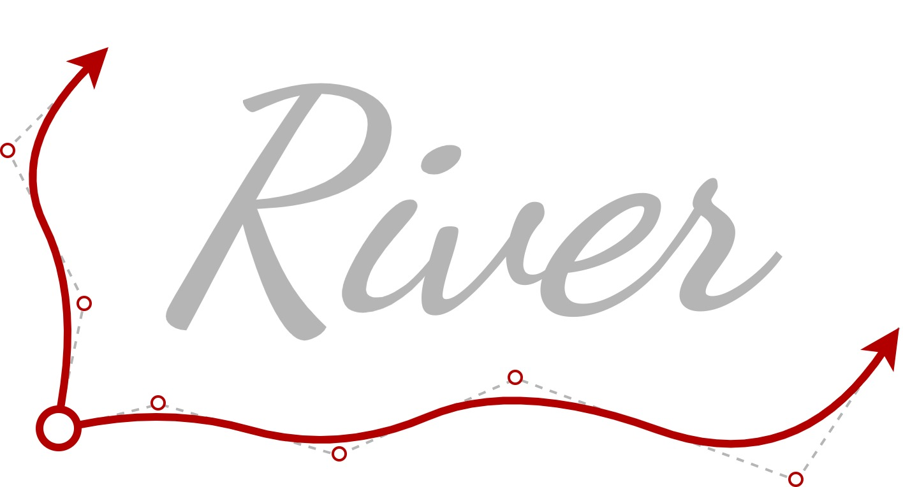
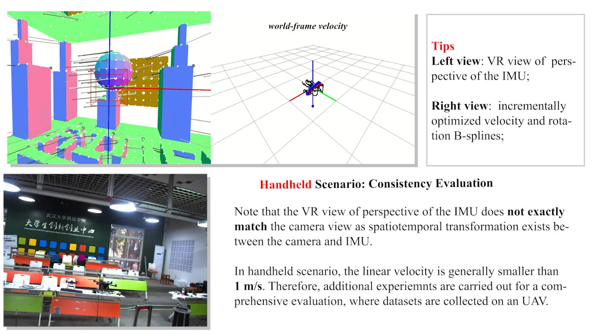
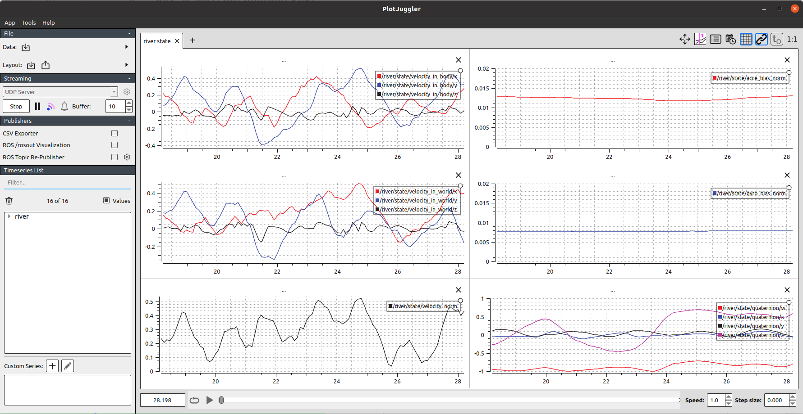
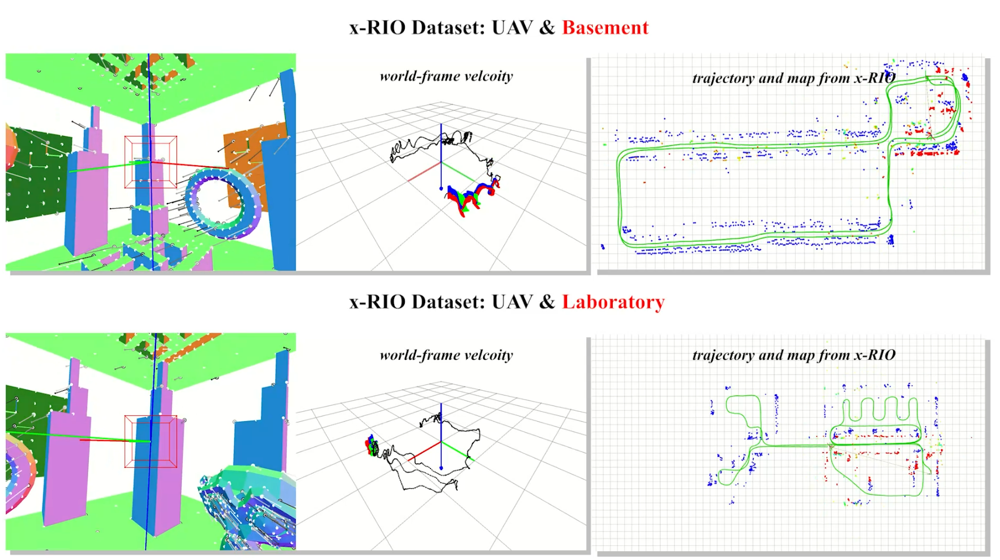
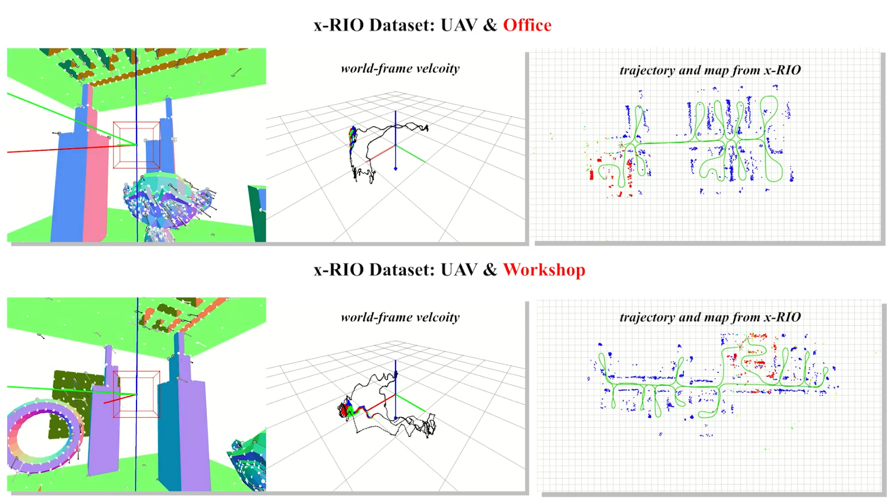

# River: A Tightly-coupled Radar-inertial Velocity Estimator

           

<div align=center></div>

### 3.2 Real-world Experiments

#### 3.2.1 Handheld

The data of the real-world experiments we conducted are available here:

```latex
# Google Drive
https://drive.google.com/drive/folders/1olNgh9i_lmJ96gZB6oxYUSqACBpOzY7u?usp=drive_link
```

Each data contains a ros bag and an information file:

+ `radars_imus.bag`: the ros bag which contains the measurements of two IMUs and radars, they are:

  ```latex
  path:        radars_imus.bag
  version:     2.0
  duration:    3:26s (206s)
  start:       Sep 26 2023 14:46:05.22 (1695710765.22)
  end:         Sep 26 2023 14:49:31.50 (1695710971.50)
  size:        69.7 MB
  messages:    347984
  compression: none [88/88 chunks]
  types:       sbg_driver/SbgImuData      [59cc541d794c367e71030fa700720826]
               sensor_msgs/Imu            [6a62c6daae103f4ff57a132d6f95cec2]
               ti_mmwave_rospkg/RadarScan [ca47afe7b19c0dbeb8f6b51574599509]
  topics:      /imu1/frame     82507 msgs    : sensor_msgs/Imu           
               /imu2/frame     40424 msgs    : sbg_driver/SbgImuData     
               /radar1/scan   130741 msgs    : ti_mmwave_rospkg/RadarScan
               /radar2/scan    94312 msgs    : ti_mmwave_rospkg/RadarScan
  ```

+ `duration.txt`: the file that records the time duration of the valid data piece (they are excited sufficiently, and thus could be used for calibration).


The next steps are simple, just modify the file paths of the ros bag in the configuration file, and then configure the launch file of `River`, i.e., `river-prog-handheld.launch` in the `river/launch` folder. Then, we launch '`River`':

```sh
roslaunch river river-prog-handheld.launch
```

A `pingolin`-based view window would be displays with two viewports, i.e., a VR perspective of the IMU and B-splines. The real-time states would be published through ROS and can be visualized by `plotjuggler` if you want.

<div align=center>
    
    
</div>


#### 3.2.2 UAV datasets

The attached open-source datasets in [**x-RIO**](https://github.com/christopherdoer/rio.git) are employed in this experiment ([**dataset address**](https://christopherdoer.github.io/datasets/multi_radar_inertial_datasets_JGN2022)), which contains four scenarios, namely `Basement`, `Laboratory`, `Office`, and `Workshop`. Data is collected on a UAV integrating an ADIS16448 IMU and three AWR1843BOOST radars (Center, Left and Right Radars).

```txt
path:        basement.bag
version:     2.0
duration:    6:44s (404s)
start:       Oct 28 2021 21:18:37.29 (1635427117.29)
end:         Oct 28 2021 21:25:21.54 (1635427521.54)
size:        56.4 MB
messages:    128329
compression: none [74/74 chunks]
types:       sensor_msgs/FluidPressure [804dc5cea1c5306d6a2eb80b9833befe]
             sensor_msgs/Imu           [6a62c6daae103f4ff57a132d6f95cec2]
             sensor_msgs/PointCloud2   [1158d486dd51d683ce2f1be655c3c181]
             std_msgs/Header           [2176decaecbce78abc3b96ef049fabed]
topics:      /sensor_platform/baro                   20699 msgs    : sensor_msgs/FluidPressure
             /sensor_platform/imu                    82797 msgs    : sensor_msgs/Imu          
             /sensor_platform/radar_center/scan       4140 msgs    : sensor_msgs/PointCloud2  
             /sensor_platform/radar_center/trigger    4138 msgs    : std_msgs/Header          
             /sensor_platform/radar_left/scan         4139 msgs    : sensor_msgs/PointCloud2  
             /sensor_platform/radar_left/trigger      4139 msgs    : std_msgs/Header          
             /sensor_platform/radar_right/scan        4138 msgs    : sensor_msgs/PointCloud2  
             /sensor_platform/radar_right/trigger     4139 msgs    : std_msgs/Header
```

The corresponding configure files can be found in `river/dataset` folder.

<div align=center>
    
    
</div>
