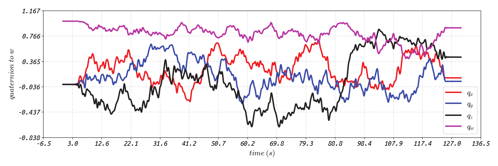
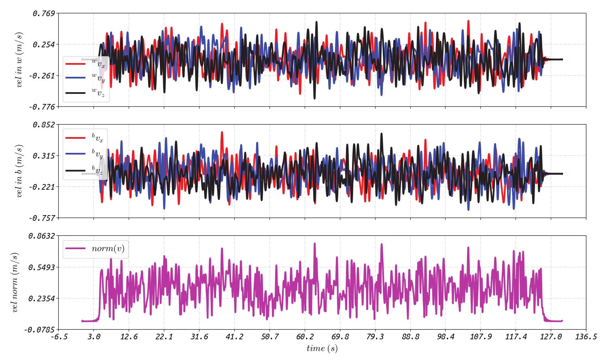

# River: A Tightly-coupled Radar-inertial Velocity Estimator

           

<div align=center></div>

### 3.1 Simulation Test

We have already deployed a a program for generating simulation data. Just go to `river/launch/simu-test` folder and perform some modifies to `river-simu.launch` file if needed. Then we launch:

```sh
roslaunch river river-simu.launch
```

this would generate a simulated rosbag and some related ground-truth files:

+ `radar_imu.bag`: the simulated rosbag which contains two message topics:

  ```txt
  path:        radar_imu.bag
  version:     2.0
  duration:    2:09s (129s)
  start:       Jan 01 1970 08:00:00.00 (0.00)
  end:         Jan 01 1970 08:02:09.99 (129.99)
  size:        24.0 MB
  messages:    103996
  compression: none [31/31 chunks]
  types:       sensor_msgs/Imu            [6a62c6daae103f4ff57a132d6f95cec2]
               ti_mmwave_rospkg/RadarScan [7a726cbc7d2934bb55d96dada9040f86]
  topics:      /simu_imu/frame    52000 msgs    : sensor_msgs/Imu           
               /simu_radar/scan   51996 msgs    : ti_mmwave_rospkg/RadarScan
  ```

+ `trajectory.json`: the simulated rotation and transaction b-splines.

+ `rotation.json` and `velocity.json`: the sampled rotations and velocities based on the b-splines, you can use python scripts we provided in `river/scripts`, i.e., `rot_spline_drawer.py` and `vel_spline_drawer.py`, to visualize them:

  <div align=center>
      
      
  </div>

The next steps are simple, just modify the file paths of the ros bag in the configuration file `config-simu.yaml` in `river/dataset/simu-high-dynamic/`, and then configure the launch file of `River`, i.e., `river-prog-simu-high-dynamic.launch` in the `launch/simu-test` folder. Then, we launch '`River`':

```sh
roslaunch river river-prog-simu-high-dynamic.launch
```

<div align=center>
    
</div>